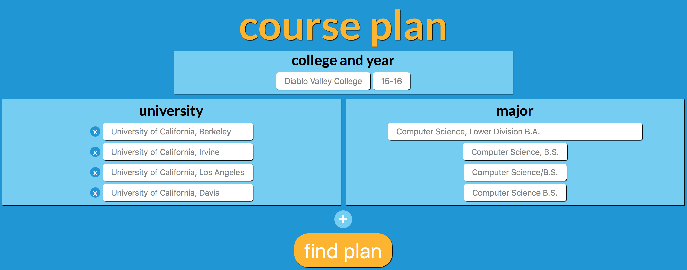
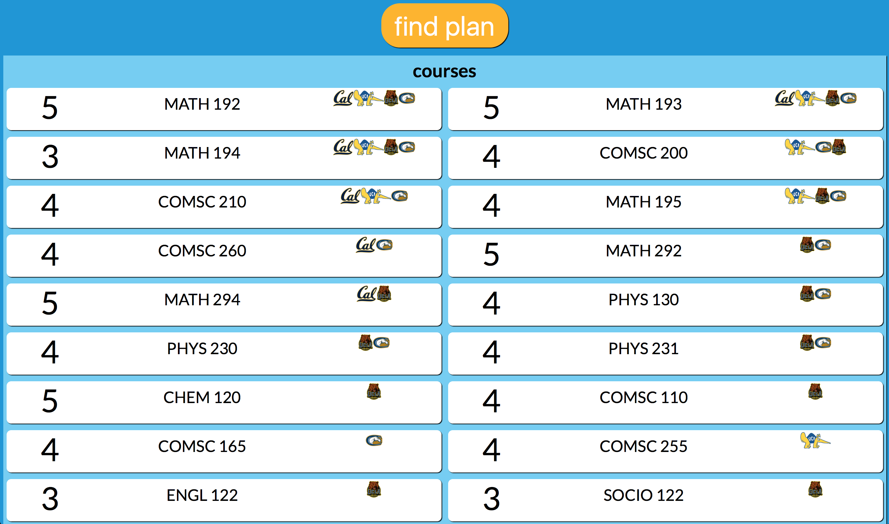
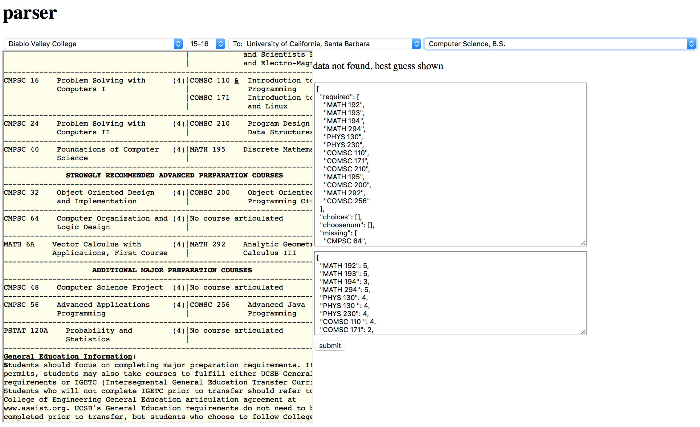

# Course Plan

## What is it?

Community college students have to juggle the requirements of every different university they hope to apply and transfer to. The aim of this web app is to act as a additional resource to California's [assist.org](http://www.assist.org).

Assist allows students and counselors to look at plans for a single university and a single major at one time, but there is no option to develop a plan for multiple universities at once, or multiple majors across different universities at once.

Course Plan solves this issue by taking the required courses for different universities and majors and developing the **optimal** plan, based on the minimal number of units possible to satsify the requirements across all selected universities/majors. As a basic illustration, if the requirements are the following:

	University A, Computer Science:
		- CS 1 (5 units)
		- CS 2 (3 units)
		- One of the following:
			- CS 3 (3 units)
			- CS 4 (5 units)
	University B, Computer Science:
		- CS 1 (5 units)
		- CS 3 (3 units)
		- One of the following:
			- CS 2 (3 units)
			- CS 4 (5 units)

This will lead to the following plan:
	
	- CS 1
	- CS 2
	- CS 3

Course Plan is not live on a server yet, but you can check it out by:

- Installing node and npm if you haven't already [install instructions](https://www.npmjs.com/package/npm)
- cloning this repository
- installing dependencies `npm install`
- starting the server `npm start`
- typing `localhost:3000` in your browser

## The site

### The main page

Select a community college, year, and then as many universities and majors as you want. The plan will be generated and displayed below.

The unit count of each course is shown on the left, the course name (community college course), and icons of the universities that particular course is required for.

### Parsing plans

To generate the data about required courses for each community college, major, and university combination, a parser page was created. It does the following for a community college, university, major combination:

- displays the plan in its entirety from assist.org
- checks if course data is already stored, allows editing of that data if so. If not
- generates a "best guess" of course requirements based on assist.org's widely varying format of displaying required courses.
- Allows the user to correct errors
- beneath the course requirements box is the unit amount for each course

Once the course requirements are submitted, it the plan is available from the main site.

## Technical Info

This project uses the JEN stack (JSON, Express, Node) 😁. Yes, using JSON for data persistence is not at all ideal, and will be changed.

Project scaffolding was generated by the express generator.

- `data` - the course requirements and unit count for courses at different community colleges
- `public` - stores the front-end stuff: Javascripts, stylesheets, and images.
- `routes` - the backend stuff. `index.html` has the interesting optimal plan articulation functions.
- `views` - the html JADE templates

The front end relies solely on Jquery and CSS. No frameworks were used.

## API endpoints

`/ccs` - list of the available community colleges

`/:cc/years` - list of the availabe years for that cc

`/:cc/:years/unis` - available majors for that cc/year

`/:cc/:year/majors` - majors for that cc/year/university

`/plan/:cc/:year/uni,major/uni,major/uni,major/ ...` - returns JSON with the optimal plan for the chosen university & major combinations

Example: `/plan/diablovalleycollege/15-16/universityofcaliforniaberkeley,computersciencelowerdivisionba/universityofcalifornialosangeles,computersciencebs`

### Parser endpoints

The follwing endpoints pull data from assist.org. They pull the `select` data for each successive step in the plan selection process. This means they return the values in each `select` element for that step.

Note that internally course-plan simply uses the name of the community college, university, and major with symbols removed to identify elements (`University of California, Berkeley` => `universityofcaliforniaberkeley`). Assist.org however uses values such as `UCB`)

`/parser/ccs` - Community college list pulled from assist.org

`/parser/years/:CCvalue` - Years for that community college, using the value provided by the assist.org CC dropdown list

`/parser/unis/:ValueFromCCandYear` - Available universities, using the insane values that assist.org uses for its institution selection form

`/parser/majors/:ValueFromCC,Year,Uni` - Available majors using the value from the CC/Year form

`/parser/plan/:UrlForPlanPage` - gets the URL for the plan alone from the Url. (This serves to find the url with just the plan rather than including unnecessary surrounding elements).

`/parser/guess/:UrlForPlanAlone` - Parses the plan, returns JSON with a best guess as to the course requirements, and unit counts.

GET `/parser/data/:cc/:year/:uni/:major/` - using the course plan method of representing items (`universityofcaliforniaberkeley`), find if data is stored for that plan yet, return the course requirements and unit counts if so.

POST `/parser/data/:cc/:year/:uni/:major/` - accepts a JSON object with college_name, uni_name, major_name, courses, and units.

## To-do

- Choosenum->choices should be arrays within arrays as with choices because there could be a choice class1 & class2 which count as one course (as in the case of UCSD computer science)

- When deployed, /parser needs to be protected

- Possibly add functionality to view plans for different years at once (because some universities are seriously slacking. smh UCSC it's 2016)

	